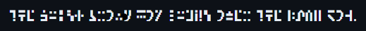

<<<<<<< HEAD
# sga-encoder

Substitutes letters from lower-ascii character table to unicode representing the galactic standard alphabet found in Commander Keen.

# Command Line

Pass text to be translated as an argument.
















































































































































































































































'
















































































































 .




















































































































































































































































































































































































































































'















































































































































































































`node index your_text_here `

```bash
node index The quick brown fox jumps over the lazy brown dog.
```
Displays         .

<p align="left">
  
</p>

# Unicode

May not work on all systems.

Uses [upper conscript registry](https://www.kreativekorp.com/ucsur/charts/sga.html) recommendations. Your operating system must have a font that supports displaying the unicode characters returned. That font must be used in the location you are viewing (terminal, code editor, web page) the results or must be installed on the system.

Based on [keen-unicoder](https://github.com/dance-dance-banana-frenzy/keen-unicoder)

View as [ ](./README-keen.md).
=======
# keen-encoder

Substitutes letters from lower-ascii character table to unicode representing the galactic standard alphabet found in Commander Keen.

# Command Line

Pass text to be translated as an argument.
`node index your_text_here `

```bash
node index The quick brown fox jumps over the lazy brown dog.
```
Displays         .

<p align="left">
  
</p>

# Unicode

May not work on all systems.

Uses [upper conscript registry](https://www.kreativekorp.com/ucsur/charts/sga.html) recommendations. Your operating system must have a font that supports displaying the unicode characters returned. That font must be used in the location you are viewing (terminal, code editor, web page) the results or must be installed on the system.

Based on [keen-unicoder](https://github.com/dance-dance-banana-frenzy/keen-unicoder)

View as [ ](./README-keen.md).
=======
# sga-encoder

Substitutes letters from lower-ascii character table to unicode representing the galactic standard alphabet found in Commander Keen.

# Command Line

Pass text to be translated as an argument.
`node index your_text_here `

```bash
node index The quick brown fox jumps over the lazy brown dog.
```
Displays         .

<p align="left">
  
</p>

# Unicode

May not work on all systems.

Uses [upper conscript registry](https://www.kreativekorp.com/ucsur/charts/sga.html) recommendations. Your operating system must have a font that supports displaying the unicode characters returned. That font must be used in the location you are viewing (terminal, code editor, web page) the results or must be installed on the system.

Based on [keen-unicoder](https://github.com/dance-dance-banana-frenzy/keen-unicoder)

View as [ ](./README-keen.md).
>>>>>>> 590f75c19cf6231e79f27b6012dbcacb86484a92
>>>>>>> 4e27fc2d916938050c1a9284d0e1b5b71f660570
